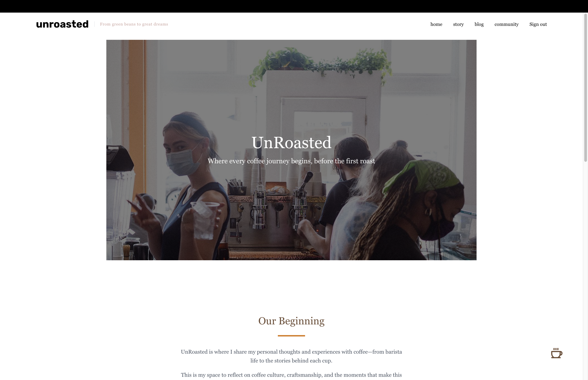
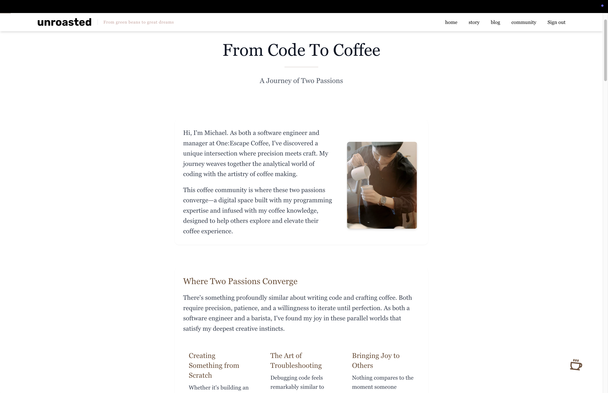
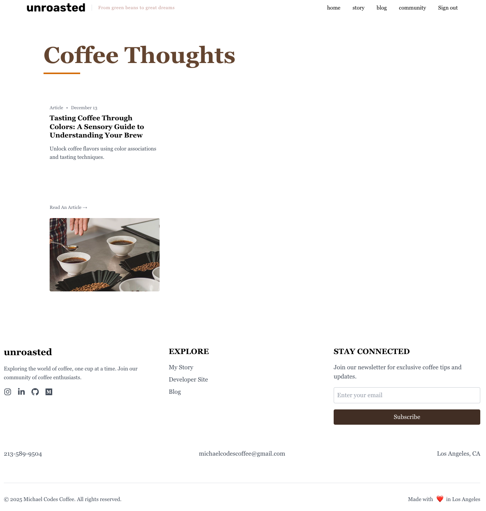
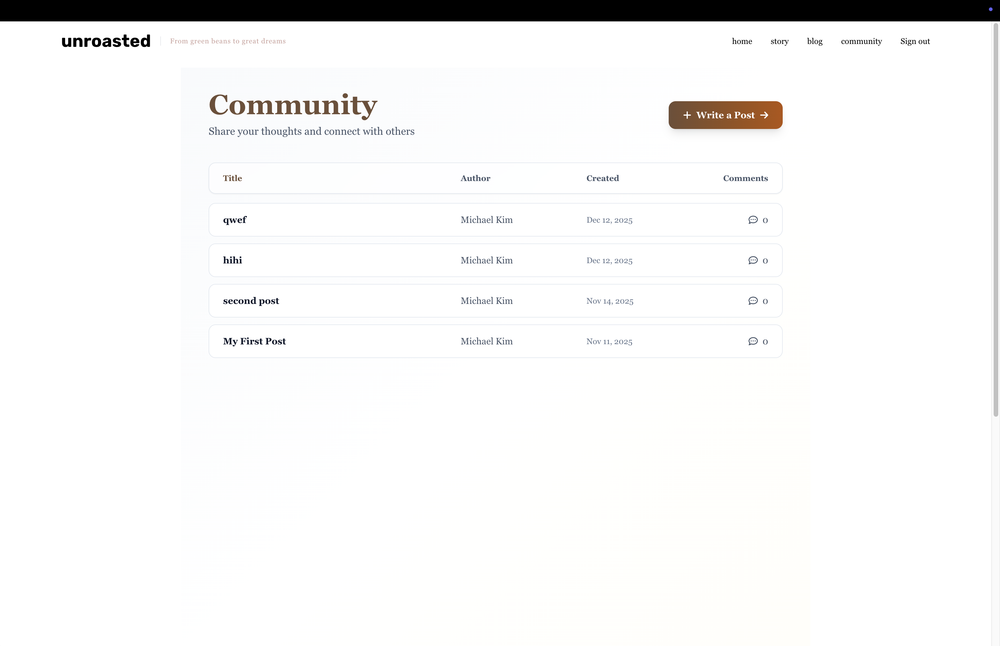
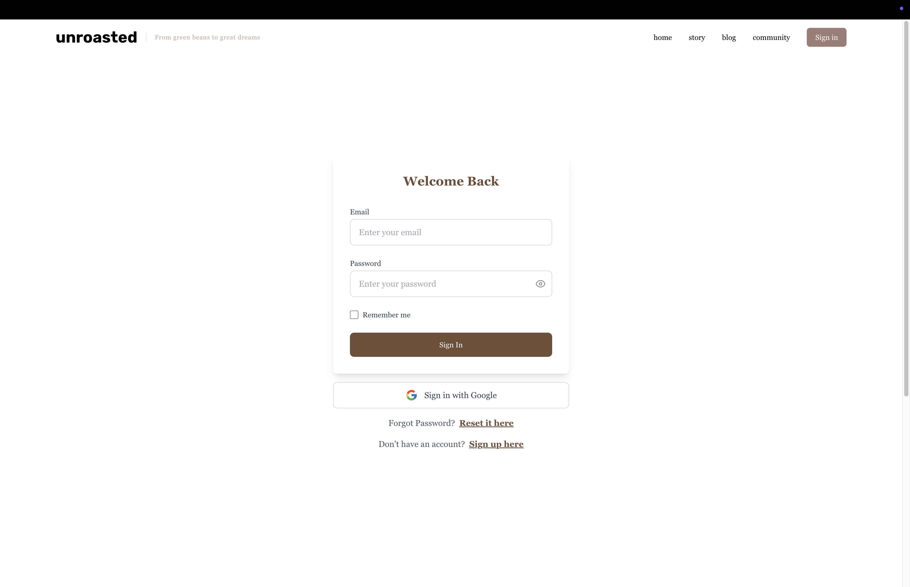

# ☕ UnRoasted - Coffee Community Platform

> A full-stack community platform for coffee enthusiasts to share their journey, thoughts, and insights.

**🔗 Live Demo:** [unroasted.vercel.app](https://unroasted.vercel.app)

---

## 🎯 About This Project

UnRoasted is a coffee community platform where I share my personal coffee journey and coffee lovers can connect, post their thoughts, and explore curated coffee insights. This project combines my passion for coffee with my skills in full-stack development.

**Why I Built This:**
As a coffee enthusiast, I wanted to create a space where people could share their coffee experiences authentically. This project allowed me to explore modern web technologies while building something I'm personally passionate about.

---

## ✨ Key Features

### 🔐 **Authentication System**
- Email/password sign up and login
- Google OAuth integration
- Password reset functionality
- Protected routes with role-based access control

### 💬 **Community Features**
- User-generated posts and discussions
- Interactive community bulletin board
- Real-time updates with Firebase
- User engagement (likes, comments)

### 📝 **Content Management**
- Personal coffee journey stories
- Curated coffee insights and articles
- Markdown support for rich content
- Headless CMS integration with Strapi

### 👨‍💼 **Admin Dashboard**
- User management interface
- Content moderation tools
- Posts management
- Role verification and access control

### 🎨 **User Experience**
- Responsive design (mobile-first)
- Smooth animations with Framer Motion
- Intuitive navigation
- Clean, modern UI with Tailwind CSS

---

## 🛠️ Tech Stack

### **Frontend**
- **React 18.3.1** - UI framework
- **Tailwind CSS** - Styling
- **Framer Motion** - Animations
- **React Router DOM** - Navigation
- **React Context API** - State management

### **Backend & Services**
- **Firebase Auth** - User authentication
- **Firebase Firestore** - Real-time database
- **Strapi CMS** - Content management
- **Express.js** - Custom API endpoints

### **Additional Libraries**
- React Hot Toast - Notifications
- Marked - Markdown parsing
- Headless UI - Accessible components

---

## 💡 What I Learned

Building UnRoasted taught me valuable lessons in full-stack development:

- **Authentication & Security**: Implementing secure user authentication with Firebase Auth and managing role-based access control
- **Database Design**: Structuring data in Firebase Firestore for optimal real-time performance
- **State Management**: Managing complex application state across multiple components using React Context
- **API Integration**: Working with headless CMS (Strapi) and building custom Express endpoints
- **User Experience**: Creating smooth, responsive interfaces with Framer Motion and Tailwind CSS
- **Deployment**: Deploying a full-stack application to production on Vercel

**Biggest Challenge:** Integrating multiple backend services (Firebase, Strapi, Express) while maintaining clean architecture and good performance. I solved this by clearly separating concerns and creating modular, reusable components.

---

## 🚀 Running Locally

```bash
# Clone the repository
git clone https://github.com/ChanYeob1202/Unroasted.git

# Navigate to project directory
cd Unroasted

# Install dependencies
npm install

# Set up environment variables
# Create .env file with your Firebase config:
# REACT_APP_FIREBASE_API_KEY=your_key
# REACT_APP_FIREBASE_AUTH_DOMAIN=your_domain
# REACT_APP_FIREBASE_PROJECT_ID=your_project_id
# REACT_APP_FIREBASE_STORAGE_BUCKET=your_bucket
# REACT_APP_FIREBASE_MESSAGING_SENDER_ID=your_sender_id
# REACT_APP_FIREBASE_APP_ID=your_app_id

# Start development server
npm start
```

Open [http://localhost:3000](http://localhost:3000) to view it in your browser.

---

## 📸 Screenshots

| Home | Story |
|:----:|:-----:|
|  |  |

| Blog | Community |
|:----:|:---------:|
|  |  |

| Authentication |
|:--------------:|
|  |

---

## 🔮 Future Enhancements

Ideas for future versions:
- Advanced search and filtering
- User profiles with coffee preferences
- Coffee shop discovery map
- Brewing guides and tutorials
- Mobile app version
- Email notifications
- Enhanced analytics dashboard

---

## 📁 Project Structure

```
Unroasted/
├── src/
│   ├── components/       # React components
│   ├── contexts/         # Context providers (Auth, etc.)
│   ├── pages/           # Page components
│   ├── services/        # API services
│   └── utils/           # Helper functions
├── public/              # Static assets
└── unRoasted/          # Additional resources
```

---

## 🤝 Connect With Me

Built with ❤️ and ☕ by ChanYeob

- **GitHub:** [@ChanYeob1202](https://github.com/ChanYeob1202)
- **LinkedIn:** [Your LinkedIn]
- **Portfolio:** [Your Portfolio]

---

## 📝 License

This project is open source and available under the [MIT License](LICENSE).
